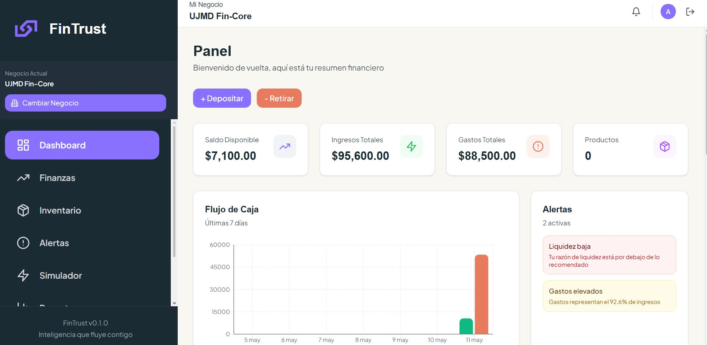
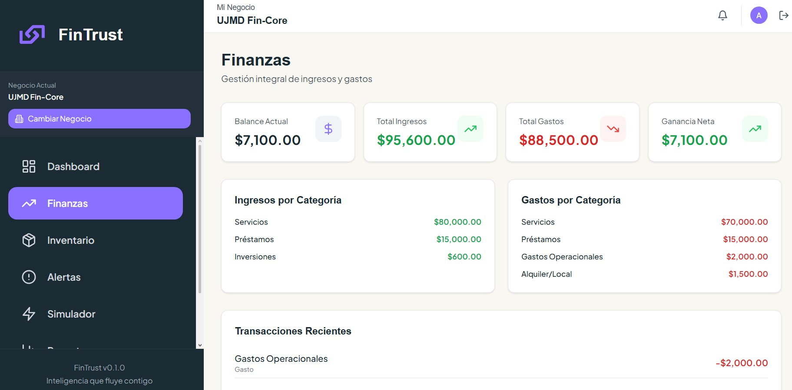
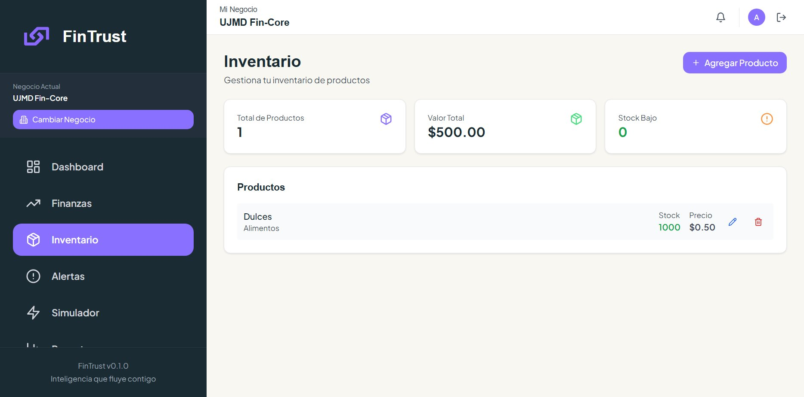
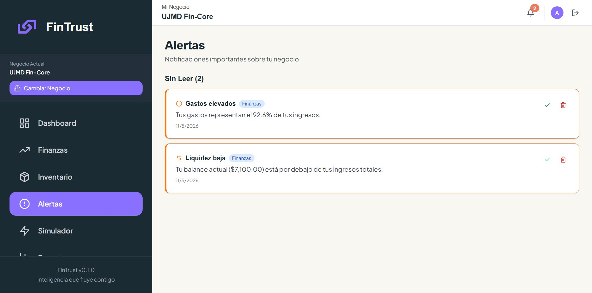
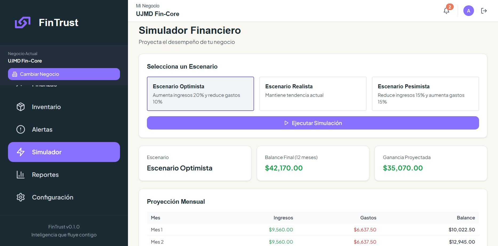
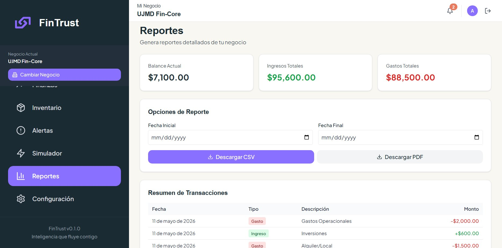
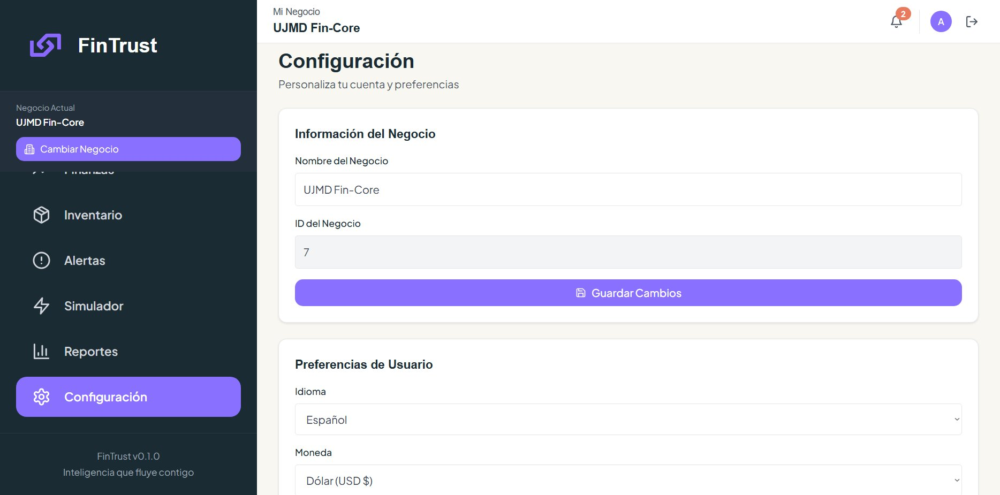
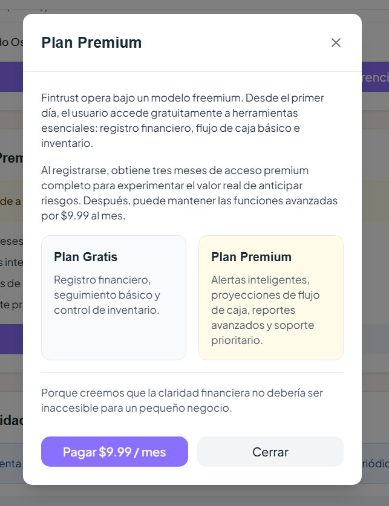

# FinTrust
> Inteligencia que fluye contigo.

---

## Descripcion

FinTrust es una plataforma web inteligente diseñada para ayudar a micro y pequeñas empresas salvadoreñas a anticipar riesgos financieros y operativos antes de que se conviertan en crisis.

En El Salvador, las MYPES representan el 99.6% de las empresas del país, pero el 69% sobrevive en condiciones de subsistencia (CONAMYPE). El problema no es únicamente vender — es que la mayoría de emprendedores toman decisiones importantes sin claridad financiera: compran inventario a ojo, mezclan dinero personal con el del negocio y descubren problemas de liquidez cuando ya es demasiado tarde.

FinTrust centraliza flujo de caja, gastos, inventario y señales de riesgo en una experiencia simple, visual y fácil de entender. No busca convertir al emprendedor en contador — busca ayudarlo a tomar mejores decisiones.

---

## Tech Stack

| Capa              | Tecnología          |
|-------------------|---------------------|
| Frontend          | React + TypeScript  |
| Estilos           | Tailwind CSS        |
| Routing           | React Router        |
| Estado global     | Zustand             |
| Graficas          | Recharts            |
| Iconos            | Lucide React        |
| HTTP Client       | Axios               |
| Backend           | API REST (Node.js)  |
| Persistencia local| localStorage        |
| Build tool        | Vite                |

---

## Funcionalidades

### Panel (Dashboard)
Vista general del negocio con saldo disponible, ingresos totales, gastos totales y número de productos. Incluye gráfica de flujo de caja de los últimos 7 días y alertas activas en tiempo real.

### Finanzas
Registro de ingresos y gastos con categorías predefinidas y personalizadas. Al registrar una venta, el sistema pregunta qué producto se vendió y en qué cantidad, descontándolo automáticamente del inventario.

### Inventario
Gestión de productos con nombre, categoría, cantidad, precio unitario y stock mínimo. Valor total del inventario calculado en tiempo real.

### Alertas inteligentes
Alertas dinámicas basadas en datos reales: producto agotado, stock bajo, pérdida neta, gastos elevados (>85% de ingresos), liquidez baja y sin transacciones registradas.

### Simulador financiero
Proyección a 12 meses bajo tres escenarios: optimista (+20% ingresos, -10% gastos), realista (tendencia actual) y pesimista (-15% ingresos, +15% gastos).

### Reportes
Exportación de transacciones en CSV con filtro por rango de fechas.

### Configuracion
Personalización del nombre del negocio, idioma y moneda.

---

## Modelo de negocio integrado al software

FinTrust opera bajo un modelo **Freemium**:

```
┌──────────────────────────────────────────────┐
│               PLAN GRATUITO                  │
│  • Registro financiero básico                │
│  • Flujo de caja                             │
│  • Control de inventario                     │
└──────────────────────────────────────────────┘
                      ↓
┌──────────────────────────────────────────────┐
│     PLAN PREMIUM — 3 meses gratis            │
│  • Alertas inteligentes avanzadas            │
│  • Simulador financiero con proyecciones     │
│  • Reportes exportables (CSV / PDF)          │
│  • Soporte prioritario                       │
│                              $9.99 / mes     │
└──────────────────────────────────────────────┘
```

Las funciones esenciales (registro de transacciones e inventario) están disponibles desde el inicio. Las herramientas de anticipación de riesgos (alertas inteligentes y simulador) representan el valor diferencial del plan premium.

**Mercado objetivo:** Microempresas salvadoreñas de comercio y servicios — cafeterías, tiendas en línea, mini markets, talleres, salones de belleza y negocios familiares en sus primeros años de operación.

---

## Capturas de UI/UX

### Panel principal


---

### Modulo de Finanzas


---

### Inventario


---

### Alertas inteligentes


---

### Simulador Financiero


---

### Reportes


---

### Configuracion


---

### Plan Premium


---

## Instalacion

```bash
git clone https://github.com/tu-usuario/fintrust.git
cd fintrust
npm install
npm run dev
```

Disponible en `http://localhost:3000`.

---

## Equipo

Proyecto académico desarrollado en la **Universidad Dr. José Matías Delgado (UJMD)** — El Salvador.

---

*FinTrust v0.1.0 — Porque ningún negocio debería fracasar por falta de visibilidad.*
